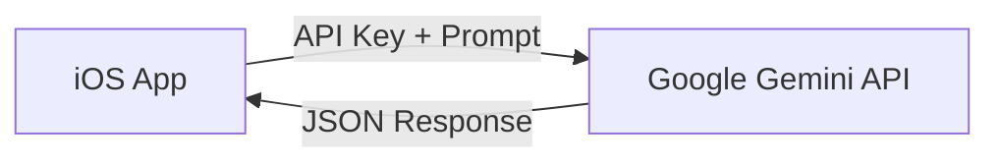
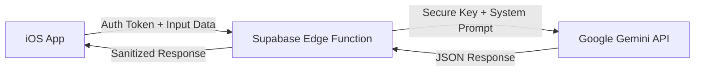

# 🚀 Gemini to Supabase Edge Functions 迁移指南

这份文档详细描述了如何将 iOS 客户端直接连接 Google Gemini 的逻辑，迁移到 Supabase Edge Functions。这不仅能保护你的 API Key，还能让你在不更新 App 的情况下调整 AI 逻辑。

## 1. 架构分析 (Architecture Analysis)

### 当前架构 (Current State)
客户端直接持有 API Key，直接向 Google 服务器发起请求。

**缺点**:
- 🚨 `GEMINI_API_KEY` 暴露在客户端二进制文件中 (即便混淆也有风险)。
- 🔄 更改提示词 (Prompt) 或模型 (Model) 需要发版更新 App。

### 目标架构 (Target State)
客户端只与你的后端 (Supabase) 通信，Supabase 负责与 AI 交互。

**优点**:
- 🔒 **安全性 (Security)**: `GEMINI_API_KEY` 仅存储在 Supabase Secrets 中，永远不接触客户端。
- ⚡️ **灵活性 (Flexibility)**: 可以在服务器端随时修改 System Prompt、切换模型版本 (e.g. Flash to Pro)，甚至切换 AI 供应商，客户端无需任何改动。

---

## 2. Supabase 设置 (Setup Steps)

### 第一步：初始化 Edge Functions
确保你电脑上安装了 Supabase CLI。

1. **登录 Supabase**:
   ```bash
   npx supabase login
   ```
2. **初始化项目** (如果你还没有):
   ```bash
   npx supabase init
   ```
3. **创建函数**:
   我们将创建一个名为 `ai-service` 的通用函数来处理所有 AI 请求。
   ```bash
   npx supabase functions new ai-service
   ```

### 第二步：配置环境变量 (Secrets)
不要把 Key 写在代码里！在 Terminal 中执行：

```bash
npx supabase secrets set GEMINI_API_KEY=your_actual_api_key_here
```
*(注意: 如果是本地开发，创建一个 `.env.local` 文件并添加到 `.gitignore`)*

---

## 3. Edge Function 实现 (Server-Side Code)

编辑 `supabase/functions/ai-service/index.ts`。我们将使用 TypeScript 编写处理逻辑。
这里采用 **Action-Based** 模式，同一个函数处理 5 种不同的请求。

```typescript
// supabase/functions/ai-service/index.ts

import { serve } from "https://deno.land/std@0.168.0/http/server.ts"
import { GoogleGenerativeAI } from "npm:@google/generative-ai" // Deno 直接支持 npm 包

const corsHeaders = {
  'Access-Control-Allow-Origin': '*',
  'Access-Control-Allow-Headers': 'authorization, x-client-info, apikey, content-type',
}

serve(async (req) => {
  // 1. 处理 CORS 预检请求 (Handle Preflight)
  if (req.method === 'OPTIONS') {
    return new Response('ok', { headers: corsHeaders })
  }

  try {
    // 2. 获取 API Key
    const apiKey = Deno.env.get('GEMINI_API_KEY')
    if (!apiKey) throw new Error('Missing GEMINI_API_KEY')

    // 3. 解析请求体
    const { action, payload } = await req.json()
    
    // 初始化 Gemini
    const genAI = new GoogleGenerativeAI(apiKey)
    // 统一使用最新的 Flash 模型
    const model = genAI.getGenerativeModel({ model: "gemini-2.5-flash" })

    let resultText = ""

    // 4. 根据 Action 分发逻辑
    switch (action) {
      case 'analyzeMeal':
        // payload: { text?: string, imageBase64?: string }
        resultText = await analyzeMeal(model, payload)
        break
        
      case 'recommend':
        // payload: { targetCalories, goal, ... }
        resultText = await generateRecommendations(model, payload)
        break
        
      case 'dayPlan':
        resultText = await generateDayPlan(model, payload)
        break
        
      case 'feedback':
        resultText = await generateFeedback(model, payload)
        break
        
      case 'stats':
        resultText = await generateStatsInsight(model, payload)
        break

      default:
        throw new Error(`Unknown action: ${action}`)
    }

    // 5. 返回结果 (保持 JSON 格式)
    return new Response(JSON.stringify({ data: resultText }), {
      headers: { ...corsHeaders, 'Content-Type': 'application/json' },
    })

  } catch (error) {
    return new Response(JSON.stringify({ error: error.message }), {
      status: 500,
      headers: { ...corsHeaders, 'Content-Type': 'application/json' },
    })
  }
})

// --- Helper Functions (对应之前的 System Prompts) ---

async function analyzeMeal(model: any, payload: any) {
  const prompt = `You are an expert Nutritionist AI... (复制之前的 System Prompt) ...`
  // 处理图片逻辑 (Base64 -> Gemini Part)
  // ...
  const result = await model.generateContent([prompt, payload.text])
  return result.response.text()
}

// 其他函数类似...
```

---

## 4. iOS 客户端重构 (Client-Side Refactoring)

我们需要修改 `GeminiService.swift`，不再直接调用 `GoogleGenerativeAI` SDK，而是调用 `SupabaseManager`。

### 新的 Service 结构

```swift
import Foundation
// 移除 import GoogleGenerativeAI

actor GeminiService: GeminiServiceProtocol {
    // 不再持有 GenerativeModel
    
    // 依赖 SupabaseManager
    private let supabase = SupabaseManager.shared.client
    
    // 定义请求结构体 (DTO)
    struct AIRequest: Codable {
        let action: String
        let payload: [String: AnyCodable] // 需要一个 AnyCodable 包装器或具体结构
    }
    
    struct AIResponse: Codable {
        let data: String
    }

    func analyzeMeal(text: String?, image: UIImage?) async throws -> MealAnalysis {
        // 1. 准备 Payload
        var payload: [String: String] = [:]
        if let t = text { payload["text"] = t }
        if let img = image {
             // 图片转 Base64 字符串
             payload["imageBase64"] = img.jpegData(compressionQuality: 0.8)?.base64EncodedString()
        }
        
        // 2. 调用 Edge Function
        let response: AIResponse = try await supabase.functions
            .invoke(
                "ai-service",
                body: AIRequest(action: "analyzeMeal", payload: payload)
            )
            .decode() // Supabase SDK 自动解码
            
        // 3. 解析结果 (保持原有逻辑)
        return try parseAnalysis(from: response.data)
    }
    
    // 其他方法 translate 类似...
}
```

---

## 5. 关键优势总结 (Key Benefits)

1.  **极简客户端**: iOS App 体积会变小，因为不再包含 Google 的 AI SDK。
2.  **网络抗性**: 如果用户网络连不上 Google (某些地区)，但能连上 Supabase，该功能依然可用 (Supabase 服务器在云端访问 Google)。
3.  **调试方便**: 你可以在 Supabase Dashboard 查看每一次 AI 调用的日志、耗时和错误，而不用依赖用户的手机日志。


## 6. 配置客户端密钥 (Client Configuration)

部署成功后，你需要将 Supabase 的连接信息填入 `Secrets.xcconfig`。


### 如何获取 Key？
1. 打开浏览器访问您的 Supabase 项目后台：
   👉 [Supabase Dashboard - API Settings](https://supabase.com/dashboard/project/euungrfqqnmgfhkptlpb/settings/api)
   *(Project Ref: `euungrfqqnmgfhkptlpb`)*

2. 在 **Project Settings > API** 页面找到：
   - **Project URL**: 这个对应 `SUPABASE_URL`
   - **Publishable key** (Name: `anon`, `public`): ✅ **请选这个！** 这个对应 `SUPABASE_ANON_KEY`。它是安全的，可以放在 App 里。
   - **Secret keys** (Name: `service_role`): ❌ **绝对不要用这个！** 这个拥有管理员权限，严禁放在客户端。

3. 将它们填入 `Config/Secrets.xcconfig`：
   ```properties
   SUPABASE_URL = 你的ProjectURL
   SUPABASE_ANON_KEY = 你的PublishableKey (anon)
   GEMINI_API_KEY = 你的GeminiKey
   ```


## 7. 下一步 (Next Steps)
完成以上配置后，运行 App，所有的 AI 请求（分析餐食、推荐、反馈等）都会通过 Supabase 转发，安全且高效！

